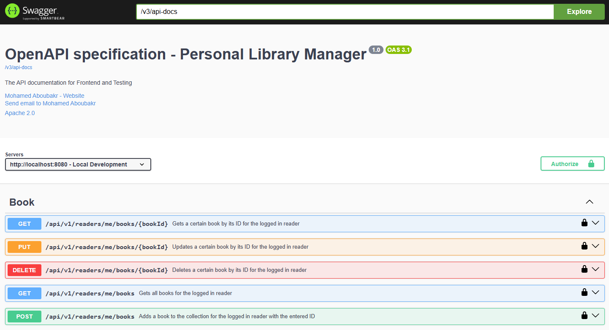

# Personal Library Manager - Containerized Spring Boot REST API



👋 Welcome to Readiction

Your reading companion that will make the reading journey much easier. An idea that came up to me when I found myself using a highlighter to highlight any quote
that I like, and also when I found out that I'm using another external app to capture any new word that I don't know what it means.

## ✨ Key Features

- **Registration:** Registering the user by creating a new account and sending him a 6-digit verification code.
- **Logging In:** The user can enter the 6-digit verification code to verify his new account and receive the JWT.
- **Adding New Book:** After logging in, the user can add the information of any new book that he has bought.
- **Updating the Book Info:** The user can also change the book info, like the status, to keep track his reading journey.
- **Adding quotes:** While reading, the user can add any quote (and its page number) that he finds interesting, so that it will be associated to the book he is
  reading.
- **Adding new words:** The user can also add any new word with its translation and related sentence (English to Arabic).

## 🏷️ Topics

[](https://www.java.com/en/)
[](https://spring.io/)
[](https://www.mysql.com/)
[](https://www.red-gate.com/products/flyway/community/)
[](https://www.docker.com/)
[](https://junit.org/)
[](https://www.postman.com/)
[](https://www.openapis.org/)
[](https://www.jwt.io/introduction#what-is-json-web-token)

## 🛠️ Requirements

- Basic knowledge of Environment Variables
- Basic knowledge of [Apache Maven](https://maven.apache.org/)
- Basic knowledge of Docker and Docker-Compose

## 🚀 Getting Started

#### Prerequisites (MacOS or Windows):

- [Git](https://git-scm.com/) installed
- [Docker Desktop](https://docs.docker.com/get-started/get-docker/) installed
- Any IDE installed (preferred [Intellij IDEA](https://www.jetbrains.com/idea/))
- Any browser installed

1. #### Open Docker Desktop to run Docker Engine
2. #### Open Intellij IDEA
3. #### Open any terminal

4. #### Navigate to a folder where you want to clone the project (e.g., Desktop)

    ```bash
    cd Desktop
    ```

5. #### Clone the repo

    ```bash
    git clone https://github.com/Mabubakr2001/Personal-Library-Manager-Backend.git
    ```
   Replace Mabubakr2001 with your actual GitHub username if you fork this project

6. #### Navigate to the folder

    ```bash
    cd Personal-Library-Manager-Backend
    ```

7. ### Open .env.db.example from Intellij (for MySQL container)

   ```
   MYSQL_ROOT_PASSWORD=your_database_password
   ```
   Change the placeholder for each property ```your_database_password``` (e.g., password)

8. ### Open .env.app.example from Intellij (for the app container)

   ```
   SPRING_DATASOURCE_USERNAME=your_database_username
   ```
   Change the placeholder for each property ```your_database_username``` (e.g., root)

9. ### Build the app image

   ```bash
   docker build -t library-manager:1.0 -f docker/app/Dockerfile .
   ```

10. ### Build and run the container from the image

```bash
 docker-compose up
```

11. ### Stop and remove the container (when needed)
   ```bash
   docker-compose down
   ```

## ❤️ Author

[](https://www.linkedin.com/in/moaboubakr2001/)
[](https://bakr-portfolio.web.app/)